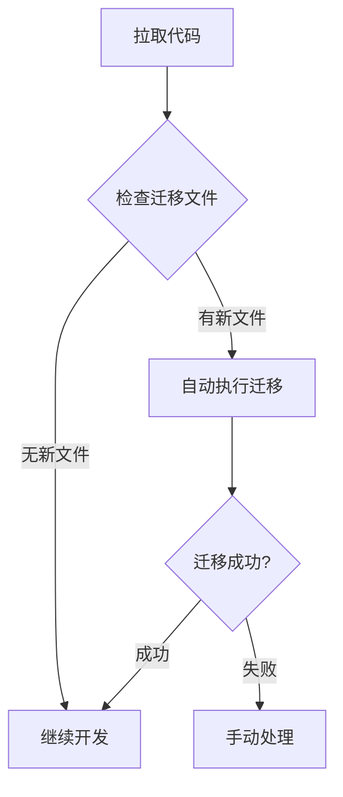

# 自动数据库迁移指南

本指南介绍如何在开发环境中自动处理数据库迁移，支持Docker和本地环境。

## 🚀 快速开始

### 1. 设置自动迁移环境

```bash
# 在项目根目录运行
./scripts/development/auto-migration-setup.sh
```

### 2. 验证设置

```bash
# 检查迁移状态
./scripts/development/check-migration-status.sh

# 手动执行迁移
./scripts/development/auto-migrate.sh
```

## 📋 支持的环境

### Docker环境（推荐）

- **优势**: 环境一致性好，依赖管理简单
- **要求**: Docker和docker-compose已安装
- **启动**: `docker-compose up -d`

### 本地环境

- **优势**: 开发调试方便，启动速度快
- **要求**: Python环境和alembic已安装
- **配置**: 需要正确的数据库连接配置

## 🔄 自动化流程

### Git Hooks

设置完成后，以下操作会自动触发迁移检查：

1. **git pull / git merge**: 检查是否有新的迁移文件
2. **git checkout**: 切换分支后检查迁移状态

### 工作流程



## 🛠️ 手动操作

### 检查迁移状态

```bash
# 使用脚本检查
./scripts/development/check-migration-status.sh

# Docker环境手动检查
docker exec fba_server bash -c "cd /fba && alembic current"
docker exec fba_server bash -c "cd /fba && alembic heads"

# 本地环境手动检查
alembic current
alembic heads
```

### 执行迁移

```bash
# 使用脚本执行
./scripts/development/auto-migrate.sh

# Docker环境手动执行
docker exec fba_server bash -c "cd /fba && alembic upgrade head"

# 本地环境手动执行
alembic upgrade head
```

### 生成新迁移

```bash
# Docker环境
docker exec fba_server bash -c "cd /fba && alembic revision --autogenerate -m 'description'"

# 本地环境
alembic revision --autogenerate -m "description"
```

## ⚠️ 注意事项

### 环境切换

- 从Docker切换到本地环境时，确保数据库连接配置正确
- 从本地切换到Docker环境时，确保容器已启动

### 迁移文件管理

- 始终检查自动生成的迁移文件
- 提交前确保迁移文件正确
- 避免多人同时生成迁移文件

### 故障排除

1. **迁移失败**: 检查数据库连接和权限
2. **多头版本**: 使用 `alembic merge` 合并分支
3. **环境不匹配**: 确保数据库schema一致

## 📚 相关文档

- [Alembic最佳实践](./BEST_PRACTICES.md)
- [数据库迁移规范](../backend/alembic/README.md)
- [开发环境搭建](./local-development.md)
